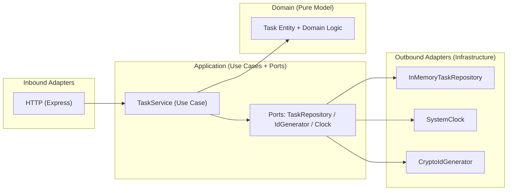
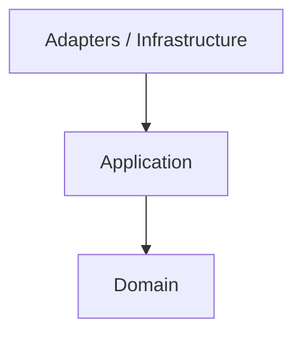
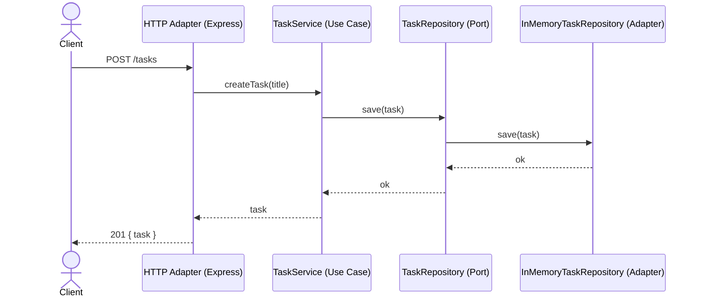

# Hexagonal Architecture (TypeScript)

Hexagonal Architecture（Ports and Adapters）を学ぶための最小バックエンド例です。
ビジネスロジックを中心に置き、外部I/O（HTTP/DB/Clock など）をアダプタとして分離します。
このプロジェクトは `pnpm` で管理します。

## 目的 / ゴール

- 依存方向を `domain <- application <- adapters/infrastructure` に固定する
- テスト容易性と変更容易性を高める（外部I/Oの差し替えが容易）
- “ユースケース”を中心に設計する思考を身につける

## アーキテクチャイメージ



### 依存方向（重要）



## Structure

```
src/
  adapters/http/
    server.ts
    taskRoutes.ts
  application/
    errors/errors.ts
    ports/
      clock.ts
      idGenerator.ts
      taskRepository.ts
    services/taskService.ts
  config/
    container.ts
  domain/
    task.ts
  infrastructure/
    clock/systemClock.ts
    id/cryptoIdGenerator.ts
    persistence/inMemoryTaskRepository.ts
  index.ts
```

## このリポジトリの対応関係

- Domain: `src/domain/task.ts`
- Application (Use Case): `src/application/services/taskService.ts`
- Ports: `src/application/ports/*.ts`
- Errors: `src/application/errors/errors.ts`
- Outbound Adapters: `src/infrastructure/clock/systemClock.ts`
- Outbound Adapters: `src/infrastructure/id/cryptoIdGenerator.ts`
- Outbound Adapters: `src/infrastructure/persistence/inMemoryTaskRepository.ts`
- Inbound Adapter (HTTP): `src/adapters/http/server.ts`
- Inbound Adapter (HTTP): `src/adapters/http/taskRoutes.ts`
- Wiring: `src/config/container.ts`
- Entrypoint: `src/index.ts`

## Request Flow イメージ



## Quick Start

```bash
pnpm install
pnpm dev
```

## Scripts

- `pnpm dev`: TSX watch で開発サーバ起動（`src/index.ts`）
- `pnpm build`: TypeScript を `dist/` にビルド
- `pnpm start`: `dist/index.js` を起動

## API

| Method | Path | Description | Body |
| --- | --- | --- | --- |
| GET | `/health` | 稼働確認 | なし |
| GET | `/tasks` | タスク一覧 | なし |
| POST | `/tasks` | タスク作成 | `{ "title": "..." }` |
| POST | `/tasks/:id/complete` | タスク完了 | なし |

バリデーションエラーは `400`、対象がない場合は `404` を返します。

## Example Requests

```bash
curl -s http://localhost:3000/health

curl -s -X POST http://localhost:3000/tasks \
  -H 'Content-Type: application/json' \
  -d '{"title":"Learn hexagonal"}'

curl -s http://localhost:3000/tasks

curl -s -X POST http://localhost:3000/tasks/<id>/complete
```

## Notes

- `InMemoryTaskRepository` は実DBのアダプタに置き換え可能です。
- 外部サービス連携が必要になったら Ports を追加してください。
