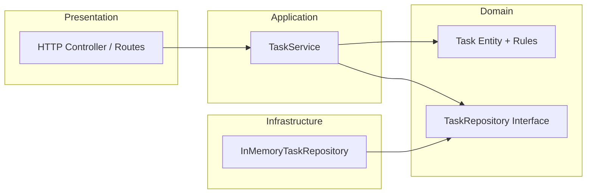
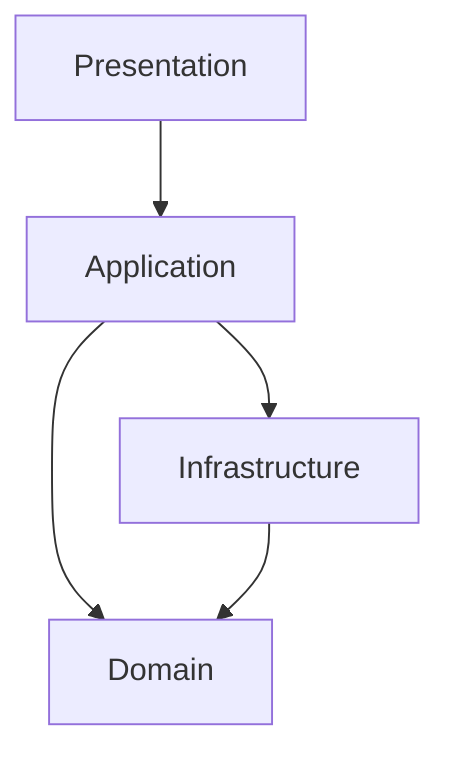
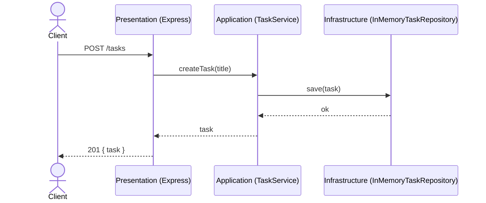

# Layered Architecture (TypeScript)

Layered Architecture（レイヤードアーキテクチャ）を学ぶための最小バックエンド例です。
責務を Presentation / Application / Domain / Infrastructure に分け、依存方向を上位から下位へ固定します。
このプロジェクトは `pnpm` で管理します。

## 目的 / ゴール

- 依存方向を `presentation -> application -> domain` で固定する
- Infrastructure は domain の型に依存し、application から利用される
- 変更影響を局所化し、テスト容易性を高める

## アーキテクチャイメージ



### 依存方向（重要）



## Structure

```
src/
  presentation/http/
    server.ts
    taskRoutes.ts
  application/
    errors.ts
    taskService.ts
  domain/
    task.ts
    taskRepository.ts
  infrastructure/
    persistence/inMemoryTaskRepository.ts
  index.ts
```

## このリポジトリの対応関係

- Presentation: `src/presentation/http/server.ts`
- Presentation: `src/presentation/http/taskRoutes.ts`
- Application: `src/application/taskService.ts`
- Application Errors: `src/application/errors.ts`
- Domain Entity: `src/domain/task.ts`
- Domain Repository Interface: `src/domain/taskRepository.ts`
- Infrastructure Repository: `src/infrastructure/persistence/inMemoryTaskRepository.ts`
- Entrypoint: `src/index.ts`

## Request Flow イメージ



## Quick Start

```bash
pnpm install
pnpm dev:layered
```

## Scripts

- `pnpm dev:layered`: TSX watch で開発サーバ起動（`src/index.ts`）
- `pnpm build:layered`: TypeScript を `dist/` にビルド
- `pnpm start:layered`: `dist/index.js` を起動

## API

| Method | Path | Description | Body |
| --- | --- | --- | --- |
| GET | `/health` | 稼働確認 | なし |
| GET | `/tasks` | タスク一覧 | なし |
| POST | `/tasks` | タスク作成 | `{ "title": "..." }` |
| POST | `/tasks/:id/complete` | タスク完了 | なし |

バリデーションエラーは `400`、対象がない場合は `404` を返します。

## Example Requests

```bash
curl -s http://localhost:3000/health

curl -s -X POST http://localhost:3000/tasks \
  -H 'Content-Type: application/json' \
  -d '{"title":"Learn layered"}'

curl -s http://localhost:3000/tasks

curl -s -X POST http://localhost:3000/tasks/<id>/complete
```

## Notes

- `InMemoryTaskRepository` は実DBの実装に置き換え可能です。
- 境界を維持したまま、テストは repository の差し替えで容易に書けます。
